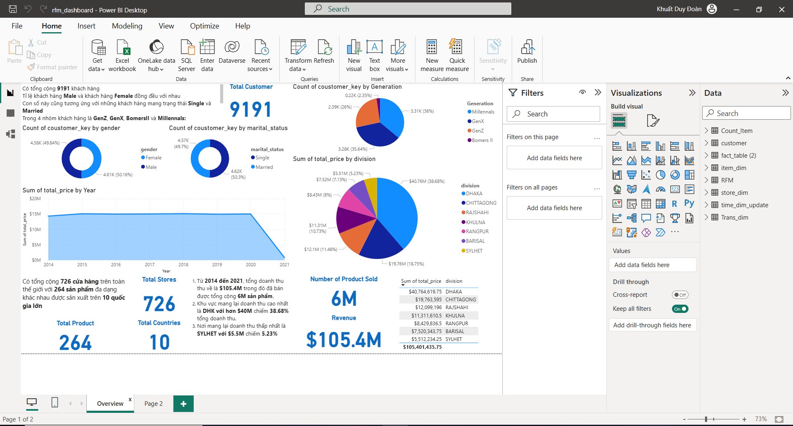
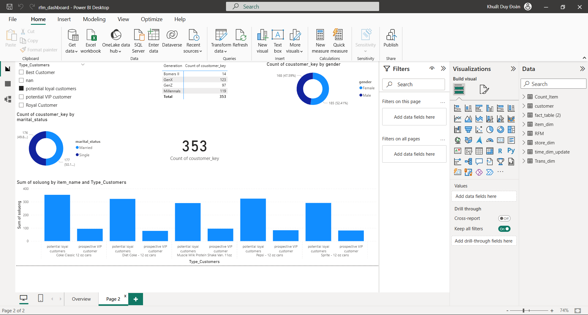

# Customer Segmentation & RFM Analysis

## Overview
This project analyzes customer purchasing behavior using RFM analysis to identify high-value customer segments and support business decision-making.

## Tools Used
- SQL
- Python
- Power BI

## Objectives
- Segment customers based on purchasing behavior
- Identify high-value customers
- Support upsell and cross-sell strategies

## Key Insights
- Millennials and Gen X are the most valuable customer groups
- Female customers contribute significantly to sales
- Beverage products are the most purchased items

## Dashboard Preview

### Overview Dashboard

### Customer Dashboard

